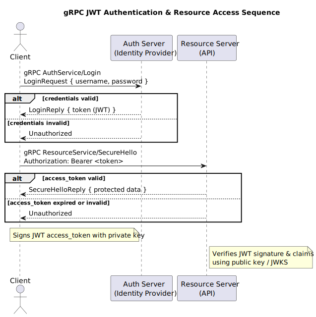

# Micronaut gRPC JWT

Example project showing how to secure **gRPC services** in **Micronaut** using **JWT authentication**.

## Flow



1. **Client** calls `AuthService/Login` with username + password.
2. **Auth Server** verifies the token:
    - ✅ valid → returns a signed JWT token.
    - ❌ invalid → returns Unauthorized
3. **Client** calls `ResourceService/SecureHello` with `Authorization: Bearer <token>`.
4. **Resource Server** verifies the token:
    - ✅ valid → returns protected data
    - ❌ invalid/expired → returns Unauthorized

## Example Client Usage
### Run from Java
Use code from method ```demoCall()``` from Main
### Run from GRCP Client
Use a gRPC client (grpcurl, Postman, or generated stubs) to:
Get a token via AuthService/Login
Call ResourceService/SecureHello with Authorization: Bearer <token>
## Run

```bash
./gradlew run